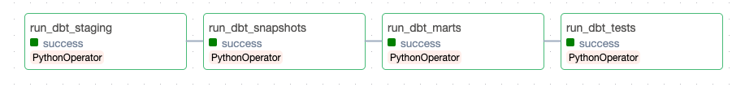
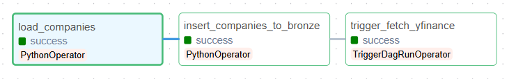
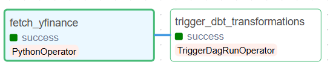
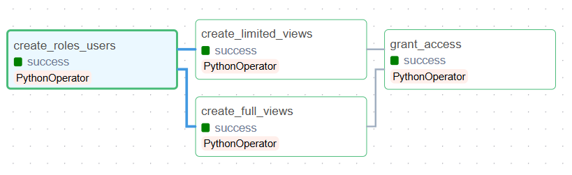

## Project setup

## Running the Project:

1. Clone the repository to your computer

2. Open the project folder in your terminal

3. Go inside the folder 'hw2'

    ```bash
    cd hw2
    ```

4. Build docker

    ```bash
    docker-compose build --no-cache
    ```
   
5. Run docker

    ```bash
    docker-compose up -d
    ```

6. Airflow is scheduled to run every day at 22:00 UTC, to run it manually:

    6.1. (Optional) Firstly pulling stock info with yfinance API takes time (~15 minutes), to shorten it you can pull less data

        5.1.1. Uncomment this line in plugins/tasks/fetch_yfinance.py file inside the fetch_stock_info() function

            # df = df.iloc[:250]

        
    6.2. Open Airflow on http://localhost:8080/home

    6.3. Log into Airflow 

        username: airflow

        password: airflow
    
    6.4. Trigger the DAG called load_companies_dag - it will trigger fetch_yfinance_dag after completion

    6.5. Wait for the DAGs to be finished 

7. Run DAG run_clickhouse_views to create views and roles

8. Access OpenMetaData via http://localhost:8585/ (full solution screenshots are in the report)

    8.1. Log into 

       email: admin@open-metadata.org

       password: admin
    
    8.2. First a database service must be registered, for that go to Settings -> Services -> Databases -> Add new service

    8.3. Choose ClickHouse service
    
    8.4. Add service name (e.g. clickhouse_warehouse) and fill out nex fields with values:

       Username: openmetadata_user

       Password: omd_pass

       Host and Port: clickhouse:8123
    
    8.5. After saving service the agents should start automatically

    8.6. Do add Apache superset dashboard  go to Settings -> Services -> Dashboards -> Add new service

    8.7. Choose superset service

    8.8. Add service name (e.g. superset_dashboard) and fill out nex fields with values:
     
       Host and Port: http://localhost:8088/

       Superset Connection: MysqlConnection 

       Username: openmetadata_user

       Password: openmetadata_password

    8.9. Same as last time after saving the service the agents should start automatically.

9. Access Apache superset via http://localhost:8585/ (Superset dashboard screenshots are in the report)

    9.1. Login with credentials:
       
       Username: admin

       Password: admin
    
    9.2. Go to Settings -> Database connections -> add database

    9.3. Use the following values for fields:

       Host: clickhouse

       Port: 8123

       Username: etl

       Password: pass

       Display name: ClickHouse Connect (Superset)
    
    9.4. After that you can go to SQL Lab and do queries like:

       select * from gold.FactFinancials
    


## DBT and ClickHouse:

Dbt graph (flow to load silver and gold schemas and run some tests):




1. Creation of roles, users and limited and full views is part of DAG run_clickhouse_views.py
    In case you would like to run them manually then you can run scripts that using following commands:

        to create users and roles:
            ```bash
            docker exec -i clickhouse clickhouse-client < clickhouse/Privacy_and_Security/01_Create_roles_users.sql 
            ```

        to run views manually if needed:
            ```bash
            docker exec -i clickhouse clickhouse-client < clickhouse/Privacy_and_Security/02_Create_full_views.sql 
            ```
            ```bash
            docker exec -i clickhouse clickhouse-client < clickhouse/Privacy_and_Security/03_Create_limited_views.sql 
            ```

2. As now schemas gold_full_views and gold_limited_views have been created then you can assign to roles access to relevant schemas:

            ```bash
            docker exec -i clickhouse clickhouse-client < clickhouse/Privacy_and_Security/04_Grant_access_to_roles.sql 
            ```
    
3. Script for creating clickhouse roles is:

        -- Create two roles
            CREATE ROLE IF NOT EXISTS analyst_full;
            CREATE ROLE IF NOT EXISTS analyst_limited;

        -- Create users (if needed)
            CREATE USER IF NOT EXISTS user_full IDENTIFIED BY 'full123';
            CREATE USER IF NOT EXISTS user_limited IDENTIFIED BY 'limited123';

        -- Grant roles to users
            GRANT analyst_full TO user_full;
            GRANT analyst_limited TO user_limited;

4. After schemas have been created:

        -- Grant SELECT on full views to role _full
            GRANT SELECT ON gold_full_views.*  TO analyst_full;

        -- Grant SELECT on masked views to role _limited
            GRANT SELECT ON gold_limited_views.*  TO analyst_limited;

5. Masking:

        As we have only public data then we don't need masking but for project we chose 3 columns.
        We have masked in DimCompany Company Name by showing only first 3 characters in name and Industry by showing Other in case there as less than 10 rows with same Industry. And then we have masked ForbesRank by showing ranges 1-99, 100-199 etc. More details in sql script 03_Create_limited_views.sql 

6. To test if access has been granted properly for a specific user you can run for example:

        ```bash
        docker exec -it clickhouse clickhouse-client --user user_full --password full123
        ```

        ```bash
        docker exec -it clickhouse clickhouse-client --user user_limited --password limited123
        ```

7. Demonstrating how access was applied. User_full can see this in v_DimCustomer view and in v_FactForbesRank:

        SELECT *
        FROM gold_full_views.v_DimCompany
        LIMIT 20

        Query id: 09ab68a1-bc06-4875-ab20-75972c2bceb6

            ┌─CompanyKey─┬─CompanyName─────────────┬─Headquarters───┬─Industry──────────────┬─Sector─┬───────────ValidFrom─┬─ValidTo─┐
         1. │    1498202 │ Thai Beverage           │ Thailand       │ Food, Drink & Tobacco │ sector │ 2025-11-26 22:00:12 │    ᴺᵁᴸᴸ │
         2. │    2345189 │ Carlsberg               │ Denmark        │ Food, Drink & Tobacco │ sector │ 2025-11-26 22:00:12 │    ᴺᵁᴸᴸ │
         3. │    5220951 │ China Reinsurance Group │ China          │ Insurance             │ sector │ 2025-11-26 22:00:12 │    ᴺᵁᴸᴸ │
         4. │    7200852 │ First Solar             │ United States  │ Semiconductors        │ sector │ 2025-11-26 22:00:12 │    ᴺᵁᴸᴸ │
         5. │    9354239 │ Absa Group              │ South Africa   │ Banking               │ sector │ 2025-11-26 22:00:12 │    ᴺᵁᴸᴸ │
         6. │    9435555 │ Comcast                 │ United States  │ Media                 │ sector │ 2025-11-26 22:00:12 │    ᴺᵁᴸᴸ │
         7. │   11038534 │ AutoZone                │ United States  │ Retailing             │ sector │ 2025-11-26 22:00:12 │    ᴺᵁᴸᴸ │
         8. │   11223193 │ KION Group              │ Germany        │ Capital Goods         │ sector │ 2025-11-26 22:00:12 │    ᴺᵁᴸᴸ │
         9. │   11561711 │ Grupo Bolivar           │ Colombia       │ Banking               │ sector │ 2025-11-26 22:00:12 │    ᴺᵁᴸᴸ │
        10. │   14081743 │ Rongsheng Petrochemical │ China          │ Trading Companies     │ sector │ 2025-11-26 22:00:12 │    ᴺᵁᴸᴸ │
        11. │   14269537 │ Leonardo                │ Italy          │ Aerospace & Defense   │ sector │ 2025-11-26 22:00:12 │    ᴺᵁᴸᴸ │
        12. │   17570256 │ Braskem                 │ Brazil         │ Chemicals             │ sector │ 2025-11-26 22:00:12 │    ᴺᵁᴸᴸ │
        13. │   18871775 │ China Resources Power   │ Hong Kong      │ Utilities             │ sector │ 2025-11-26 22:00:12 │    ᴺᵁᴸᴸ │
        14. │   19898266 │ ON Semiconductor        │ United States  │ Semiconductors        │ sector │ 2025-11-26 22:00:12 │    ᴺᵁᴸᴸ │
        15. │   21008206 │ Svenska Handelsbanken   │ Sweden         │ Banking               │ sector │ 2025-11-26 22:00:12 │    ᴺᵁᴸᴸ │
        16. │   21609815 │ WPG Holdings            │ Taiwan         │ Trading Companies     │ sector │ 2025-11-26 22:00:12 │    ᴺᵁᴸᴸ │
        17. │   25338307 │ Bendigo & Adelaide Bank │ Australia      │ Banking               │ sector │ 2025-11-26 22:00:12 │    ᴺᵁᴸᴸ │
        18. │   26896184 │ Admiral Group           │ United Kingdom │ Insurance             │ sector │ 2025-11-26 22:00:12 │    ᴺᵁᴸᴸ │
        19. │   29252092 │ Kobe Steel              │ Japan          │ Materials             │ sector │ 2025-11-26 22:00:12 │    ᴺᵁᴸᴸ │
        20. │   30430672 │ Airports of Thailand    │ Thailand       │ Transportation        │ sector │ 2025-11-26 22:00:12 │    ᴺᵁᴸᴸ │
            └────────────┴─────────────────────────┴────────────────┴───────────────────────┴────────┴─────────────────────┴─────────┘

        User_limited
        SELECT *
        FROM gold_full_views.v_FactForbesRank
        LIMIT 20

        Query id: ca120b90-10bd-4b0e-9f40-7abef46549b4

            ┌─ForbesRankKey─┬─CompanyKey─┬─Year─┬─ForbesRank─┐
         1. │    2706011932 │    1498202 │ 2025 │       1430 │
         2. │      32989423 │    2345189 │ 2025 │       1068 │
         3. │    3437575244 │    5220951 │ 2025 │        823 │
         4. │     939482241 │    7200852 │ 2025 │       1388 │
         5. │    2434062735 │    9354239 │ 2025 │        860 │
         6. │    3522948459 │    9435555 │ 2025 │         43 │
         7. │    2180687872 │   11038534 │ 2025 │        581 │
         8. │    3584919919 │   11223193 │ 2025 │       1741 │
         9. │    1801428246 │   11561711 │ 2025 │       1556 │
        10. │    2713575799 │   14081743 │ 2025 │        915 │
        11. │    3008644712 │   14269537 │ 2025 │        603 │
        12. │     929097974 │   17570256 │ 2025 │       1888 │
        13. │    2584414747 │   18871775 │ 2025 │        718 │
        14. │     797766346 │   19898266 │ 2025 │       1172 │
        15. │    4229563782 │   21008206 │ 2025 │        362 │
        16. │    2574066609 │   21609815 │ 2025 │       1679 │
        17. │    3408912498 │   25338307 │ 2025 │       1798 │
        18. │    1379357143 │   26896184 │ 2025 │       1528 │
        19. │    3764122092 │   29252092 │ 2025 │       1325 │
        20. │    1077920342 │   30430672 │ 2025 │       1843 │
            └───────────────┴────────────┴──────┴────────────┘

        USER_LIMITED:

        Has no access to full views as illustrated with below snip

        SELECT *
        FROM gold_full_views.v_FactForbesRank
        LIMIT 20

        Query id: ed453d1c-9cef-4c04-8399-42f598d7f76c


        Elapsed: 0.003 sec. 

        Received exception from server (version 24.8.14):
        Code: 497. DB::Exception: Received from localhost:9000. DB::Exception: user_limited: Not enough privileges. To execute this query, it's necessary to have the grant SELECT(ForbesRankKey, CompanyKey, Year, ForbesRank) ON gold_full_views.v_FactForbesRank. (ACCESS_DENIED)

        SELECT *
        FROM gold_limited_views.v_limited_FactForbesRank
        LIMIT 20

        Query id: f358038f-7b27-4cff-9927-aff46053a770

            ┌─ForbesRankKey─┬─CompanyKey─┬─Year─┬─ForbesRank_range─┐
         1. │    2706011932 │    1498202 │ 2025 │ 1400–1499        │
         2. │      32989423 │    2345189 │ 2025 │ 1000–1099        │
         3. │    3437575244 │    5220951 │ 2025 │ 800–899          │
         4. │     939482241 │    7200852 │ 2025 │ 1300–1399        │
         5. │    2434062735 │    9354239 │ 2025 │ 800–899          │
         6. │    3522948459 │    9435555 │ 2025 │ 0–99             │
         7. │    2180687872 │   11038534 │ 2025 │ 500–599          │
         8. │    3584919919 │   11223193 │ 2025 │ 1700–1799        │
         9. │    1801428246 │   11561711 │ 2025 │ 1500–1599        │
        10. │    2713575799 │   14081743 │ 2025 │ 900–999          │
        11. │    3008644712 │   14269537 │ 2025 │ 600–699          │
        12. │     929097974 │   17570256 │ 2025 │ 1800–1899        │
        13. │    2584414747 │   18871775 │ 2025 │ 700–799          │
        14. │     797766346 │   19898266 │ 2025 │ 1100–1199        │
        15. │    4229563782 │   21008206 │ 2025 │ 300–399          │
        16. │    2574066609 │   21609815 │ 2025 │ 1600–1699        │
        17. │    3408912498 │   25338307 │ 2025 │ 1700–1799        │
        18. │    1379357143 │   26896184 │ 2025 │ 1500–1599        │
        19. │    3764122092 │   29252092 │ 2025 │ 1300–1399        │
        20. │    1077920342 │   30430672 │ 2025 │ 1800–1899        │
            └───────────────┴────────────┴──────┴──────────────────┘

        SELECT *
        FROM gold_limited_views.v_limited_DimCompany
        WHERE Industry_masked = 'Other'

        Query id: acfad185-3d30-4f34-95e5-6bb023f1769b

        ┌─CompanyKey─┬─CompanyName_masked─┬─Headquarters─────────┬─Industry_masked─┬─Sector─┬───────────ValidFrom─┬─ValidTo─┐
        1. │  996027435 │ Foc***             │ China                │ Other           │ sector │ 2025-11-26 22:00:12 │    ᴺᵁᴸᴸ │
        2. │ 1020744919 │ 0.0***             │ United States        │ Other           │ sector │ 2025-11-26 22:00:12 │    ᴺᵁᴸᴸ │
        3. │ 1387160080 │ Cat***             │ United States        │ Other           │ sector │ 2025-11-26 22:00:12 │    ᴺᵁᴸᴸ │
        4. │ 1920135996 │ Ama***             │ United States        │ Other           │ sector │ 2025-11-26 22:00:12 │    ᴺᵁᴸᴸ │
        5. │ 2141452240 │ GS ***             │ South Korea          │ Other           │ sector │ 2025-11-26 22:00:12 │    ᴺᵁᴸᴸ │
        6. │ 2542415425 │ Int***             │ United Arab Emirates │ Other           │ sector │ 2025-11-26 22:00:12 │    ᴺᵁᴸᴸ │
        7. │ 2647474541 │ Jar***             │ Bermuda              │ Other           │ sector │ 2025-11-26 22:00:12 │    ᴺᵁᴸᴸ │
        8. │ 4196625743 │ Air***             │ United States        │ Other           │ sector │ 2025-11-26 22:00:12 │    ᴺᵁᴸᴸ │
        └────────────┴────────────────────┴──────────────────────┴─────────────────┴────────┴─────────────────────┴─────────┘

        At the same time with full_user we cannot find Industry Other

        SELECT *
        FROM gold_full_views.v_DimCompany
        WHERE Industry = 'Other'

        Query id: cadcd311-71a6-4613-a021-18ba33199f7b

        Ok.

        0 rows in set. Elapsed: 0.010 sec. Processed 1.70 thousand rows, 41.92 KB (178.63 thousand rows/s., 4.39 MB/s.)
        Peak memory usage: 1.48 KiB.

        SELECT
            Industry,
            count(*)
        FROM gold_full_views.v_DimCompany
        GROUP BY Industry
        HAVING count(CompanyKey) < 10

        Query id: 36d8be63-be83-4fd6-b42f-cbf1adf96a57

        ┌─Industry───────────────────────────────┬─count()─┐
        │ Conglomerates                          │       5 │
        │ Retail and Wholesale                   │       1 │
        │ Engineering, Manufacturing             │       1 │
        │ Construction, Chemicals, Raw Materials │       1 │
        └────────────────────────────────────────┴─────────┘


## Airflow

Daily at 22:00 UTC
```
┌─────────────────────────────┐
│     load_companies_dag      │
│  (Loads data from MongoDB)  │
│  (insert_companies_to_bronze│
│   loads data into the bronze│
│   layer)                    │ 
└─────────────┬───────────────┘
              │ 
              │ Trigger next DAG
              │ with data from MongoDB
              │ 
              ▼
┌──────────────────────────────┐
│      fetch_yfinance_dag      │
│  (Fetch data from yfinance,  │
│  loads data into ClickHouse, │
│  inserts stocks data to      │
│   bronze layer)              │
└──────────────────────────────┘
              │ 
              │ 
              │ 
              │ 
              ▼
┌──────────────────────────────┐
│    run_dbt_transformations   │
│  (create dbt snapshots,      │
│  tranform data from Bronze   │
│   to Silver(staging)         │
│   to Gold(Marts)             │
│   run dbt tests).            │
└──────────────────────────────┘


┌──────────────────────────────┐
│    run_clickhouse_views      │
│   create roles and views     │
│       in clickhouse          │
│                              │
│                              │
│                              │
└──────────────────────────────┘
```
</pre>





### Overview

The workflow involves two DAGs

<b>DAG 1: </b>load_companies_dag

    Every day at 22:00 UTC Airflow triggers this DAG and executes the function load_companies_from_mongodb, which does the following:
    . Connects to MongoDB to retrieve the company data.
    . Converts the list of company records into a Python dictionary, which is pushed to XCom, so it can be sent to the second DAG.
    Once the company data is loaded, this task triggers the fetch_yfinance_dag DAG

<b>DAG 2: </b>fetch_yfinance_dag 

    This DAG executes the function fetch_stock_info, which does the following:
    . Takes the data from first DAG and does data cleaning - ignores the rows where stock ticker is null, none or nan and cheks that it is unique. (those values that fail these checks are not added to Clickhouse)
    . Fetches stock information for each company from Yahoo Finance using the yfinance package.
    . Each stock's data (such as open price, close price, market cap, etc.) is extracted and formatted as a dictionary.
    . The stock data is passed to the insert_stocks_to_bronze function, which inserts the data into ClickHouse.

The time 22:00 UTC was specifically chosen, so that all the markets around the world would be closed fo that day.

## Example analytical queries

**1. Which industries have the highest market capitalization among top 20 rank using a 3 month rolling average?**
```
WITH RollingAvg AS (
    SELECT
        dc.Industry AS Industry,
        dd.Year AS Year,
        dd.Month AS Month,
        AVG(fs.MarketCap) OVER (
            PARTITION BY dc.Industry
            ORDER BY dd.Year, dd.Month
            ROWS BETWEEN 2 PRECEDING AND CURRENT ROW
        ) AS avg_3m_marketcap
    FROM gold.FactStock fs
    JOIN gold.DimTicker dt ON fs.TickerKey = dt.TickerKey
    JOIN gold.DimDate dd ON fs.DateKey = dd.DateKey
    JOIN bronze.companies_raw_view cr ON dt.TickerSymbol = cr.ticker
    JOIN gold.DimCompany dc ON CAST(xxHash64(concat(cr.company, cr.headquarters)) AS UInt32) = dc.CompanyKey
    JOIN gold.FactForbesRank fr ON dc.CompanyKey = fr.CompanyKey
    WHERE fr.ForbesRank <= 20
)
SELECT 
    ra.Industry, 
    ra.Year, 
    ra.Month, 
    ra.avg_3m_marketcap
FROM RollingAvg ra
ORDER BY ra.avg_3m_marketcap DESC
LIMIT 10;
```
```

    ┌─Industry────────────────────────┬─Year─┬─Month─┬───avg_3m_marketcap─┐
 1. │ Technology Hardware & Equipment │ 2025 │    11 │    700058194411520 │
 2. │ Technology Hardware & Equipment │ 2025 │    11 │    700058194411520 │
 3. │ Technology Hardware & Equipment │ 2025 │    11 │  468037157082453.3 │
 4. │ Technology Hardware & Equipment │ 2025 │    11 │ 236016119753386.66 │
 5. │ IT Software & Services          │ 2025 │    11 │      3848559656960 │
 6. │ IT Software & Services          │ 2025 │    11 │      3848559656960 │
 7. │ IT Software & Services          │ 2025 │    11 │ 3110434461013.3335 │
 8. │ Banking                         │ 2025 │    11 │      2814211784704 │
 9. │ Retail and Wholesale            │ 2025 │    11 │      2610764447744 │
10. │ Retail and Wholesale            │ 2025 │    11 │      2610764447744 │
    └─────────────────────────────────┴──────┴───────┴────────────────────┘
```

**2. What is a company's valuation relative to its earnings performance. Name top 10 stocks per P/E (price to earnings) ratio?**
```
SELECT 
    dd.Year,
    dd.Month,
    dd.Day,
    dc.CompanyName,
    dc.Industry,
    AVG(fs.ClosePrice) / NULLIF(AVG(ff.Profit), 0) AS pe_ratio
FROM gold.FactStock fs
JOIN gold.DimTicker dt ON fs.TickerKey = dt.TickerKey
JOIN bronze.companies_raw cr ON dt.TickerSymbol = cr.ticker
JOIN gold.DimCompany dc ON CAST(xxHash64(concat(cr.company, cr.headquarters)) AS UInt32) = dc.CompanyKey
JOIN gold.FactFinancials ff ON dc.CompanyKey = ff.CompanyKey
JOIN gold.DimDate dd ON fs.DateKey = dd.DateKey
GROUP BY dd.Year, dd.Month, dd.Day, dc.CompanyName, dc.Industry
HAVING AVG(ff.Profit) > 0
ORDER BY pe_ratio DESC
LIMIT 10;
```
```
    ┌─dd.Year─┬─Month─┬─Day─┬─CompanyName───────────────────────────────┬─Industry────────────────────────┬───────────pe_ratio─┐
 1. │    2025 │    11 │   2 │ Samsung SDI                               │ Capital Goods                   │ 4120.2531645569625 │
 2. │    2025 │    11 │   2 │ DCI Indonesia                             │ Business Services & Supplies    │ 3850.7462686567164 │
 3. │    2025 │    11 │   2 │ CJ Corporation                            │ Food, Drink & Tobacco           │               2000 │
 4. │    2025 │    11 │   2 │ LS Corp                                   │ Capital Goods                   │               1250 │
 5. │    2025 │    11 │   2 │ LG Innotek Co.,                           │ Technology Hardware & Equipment │  804.5774647887324 │
 6. │    2025 │    11 │   2 │ Vingroup                                  │ Construction                    │ 453.55555555555554 │
 7. │    2025 │    11 │   2 │ Grupo Bolivar                             │ Banking                         │  446.7724867724868 │
 8. │    2025 │    11 │   2 │ Korea Shipbuilding & Offshore Engineering │ Capital Goods                   │ 404.82456140350877 │
 9. │    2025 │    11 │   2 │ Hanwha Ocean                              │ Capital Goods                   │  381.0810810810811 │
10. │    2025 │    11 │   2 │ Krafton                                   │ IT Software & Services          │  283.1765935214211 │
    └─────────┴───────┴─────┴───────────────────────────────────────────┴─────────────────────────────────┴────────────────────┘
```

**3. Higher ROA indicates how well a company is converting its assets into new income. Which companies or industries are most efficient based on  their ROA (name top 10)?**
```
SELECT 
    dc.CompanyName,
    dc.Industry,
    (CAST(ff.Profit AS Float64) / NULLIF(CAST(ff.Assets AS Float64), 0)) AS roa
FROM gold.DimCompany dc
JOIN gold.FactFinancials ff ON dc.CompanyKey = ff.CompanyKey
WHERE ff.Assets > 0
ORDER BY roa DESC
LIMIT 10;
```
```
    ┌─CompanyName──────────────┬─Industry────────────────────────┬────────────────roa─┐
 1. │ Inhibrx Biosciences      │ Drugs & Biotechnology           │  9.337016574585636 │
 2. │ RattanIndia Power        │ Utilities                       │  1.131578947368421 │
 3. │ EXOR                     │ Diversified Financials          │ 0.7071651090342679 │
 4. │ NVIDIA                   │ Semiconductors                  │ 0.6530465949820788 │
 5. │ VeriSign                 │ IT Software & Services          │ 0.5448275862068965 │
 6. │ Americanas               │ Retailing                       │ 0.5441696113074205 │
 7. │ Savola Group             │ Food, Drink & Tobacco           │ 0.5325131810193322 │
 8. │ Monolithic Power Systems │ Semiconductors                  │  0.494475138121547 │
 9. │ Oi                       │ Telecommunications Services     │ 0.4708994708994709 │
10. │ Ubiquiti                 │ Technology Hardware & Equipment │  0.376271186440678 │
    └──────────────────────────┴─────────────────────────────────┴────────────────────┘
```
**4. Is the company over or undervalued compared to its peers? List for each industry the average P/E using only Forbes 2000 data and select the top company for each sector based on P/E including the delta with the average of that industry.**
```
WITH IndustryPE AS (
    SELECT 
        MAX(dd.TradingDate) as TradingDate,
        dc.Industry,
        AVG(fs.ClosePrice / NULLIF(ff.Profit, 0)) AS avg_pe
    FROM gold.FactStock fs
    JOIN gold.DimTicker dt ON fs.TickerKey = dt.TickerKey
    JOIN bronze.companies_raw cr ON dt.TickerSymbol = cr.ticker
    JOIN gold.DimCompany dc ON CAST(xxHash64(concat(cr.company, cr.headquarters)) AS UInt32) = dc.CompanyKey
    JOIN gold.FactFinancials ff ON dc.CompanyKey = ff.CompanyKey
    JOIN gold.FactForbesRank fr ON dc.CompanyKey = fr.CompanyKey
    JOIN gold.DimDate dd ON fs.DateKey = dd.DateKey
    WHERE fr.ForbesRank <= 2000 AND ff.Profit > 0 AND dd.TradingDate<=now()
    GROUP BY dc.Industry, dd.TradingDate
),
CompanyPE AS (
    SELECT 
        dc.Industry,
        dc.CompanyName,
        AVG(fs.ClosePrice / NULLIF(ff.Profit, 0)) AS company_pe
    FROM gold.FactStock fs
    JOIN gold.DimTicker dt ON fs.TickerKey = dt.TickerKey
    JOIN bronze.companies_raw cr ON dt.TickerSymbol = cr.ticker
    JOIN gold.DimCompany dc ON CAST(xxHash64(concat(cr.company, cr.headquarters)) AS UInt32) = dc.CompanyKey
    JOIN gold.FactFinancials ff ON dc.CompanyKey = ff.CompanyKey
    WHERE ff.Profit > 0
    GROUP BY dc.Industry, dc.CompanyName
)
SELECT 
    ip.TradingDate,
    cp.Industry,
    cp.CompanyName,
    cp.company_pe,
    ip.avg_pe,
    cp.company_pe - ip.avg_pe AS delta
FROM CompanyPE cp
JOIN IndustryPE ip ON cp.Industry = ip.Industry
ORDER BY cp.Industry, delta DESC;
```
```
    ┌─TradingDate─┬─Industry────────────┬─CompanyName───────────────────┬───────────company_pe─┬─────────────avg_pe─┬─────────────────delta─┐
 1. │  2025-11-02 │ Aerospace & Defense │ Mitsubishi Heavy Industries   │    2.685207100591716 │ 0.5881085171045781 │    2.0970985834871376 │
 2. │  2025-11-02 │ Aerospace & Defense │ Rheinmetall                   │                  2.2 │ 0.5881085171045781 │     1.611891482895422 │
 3. │  2025-11-02 │ Aerospace & Defense │ Axon Enterprise               │   1.9651063829787234 │ 0.5881085171045781 │    1.3769978658741453 │
 4. │  2025-11-02 │ Aerospace & Defense │ TransDigm Group               │   0.7964268292682928 │ 0.5881085171045781 │   0.20831831216371466 │
 5. │  2025-11-02 │ Aerospace & Defense │ Bharat Electronics            │   0.6877516778523489 │ 0.5881085171045781 │    0.0996431607477708 │
 6. │  2025-11-02 │ Aerospace & Defense │ Teledyne Technologies         │   0.6245476477683957 │ 0.5881085171045781 │   0.03643913066381754 │
 7. │  2025-11-02 │ Aerospace & Defense │ Huntington Ingalls Industries │   0.5801272727272727 │ 0.5881085171045781 │ -0.007981244377305408 │
 8. │  2025-11-02 │ Aerospace & Defense │ Heico                         │   0.5473192239858906 │ 0.5881085171045781 │  -0.04078929311868751 │
 9. │  2025-11-02 │ Aerospace & Defense │ Rolls-Royce Holdings          │   0.3627329192546584 │ 0.5881085171045781 │  -0.22537559784991973 │
10. │  2025-11-02 │ Aerospace & Defense │ Dassault Aviation             │  0.27207207207207207 │ 0.5881085171045781 │  -0.31603644503250605 │
11. │  2025-11-02 │ Aerospace & Defense │ Thales                        │  0.25341964285714286 │ 0.5881085171045781 │  -0.33468887424743526 │
12. │  2025-11-02 │ Aerospace & Defense │ L3Harris Technologies         │  0.18493749999999998 │ 0.5881085171045781 │  -0.40317101710457814 │
13. │  2025-11-02 │ Aerospace & Defense │ Howmet Aerospace              │   0.1739396551724138 │ 0.5881085171045781 │   -0.4141688619321643 │
14. │  2025-11-02 │ Aerospace & Defense │ Northrop Grumman              │   0.1559568733153639 │ 0.5881085171045781 │   -0.4321516437892142 │
15. │  2025-11-02 │ Aerospace & Defense │ Textron                       │   0.0956867469879518 │ 0.5881085171045781 │   -0.4924217701166263 │
16. │  2025-11-02 │ Aerospace & Defense │ AIRBUS                        │   0.0464410480349345 │ 0.5881085171045781 │   -0.5416674690696436 │
17. │  2025-11-02 │ Aerospace & Defense │ GE Aerospace                  │  0.04458393113342898 │ 0.5881085171045781 │   -0.5435245859711492 │
18. │  2025-11-02 │ Aerospace & Defense │ RTX                           │   0.0385695652173913 │ 0.5881085171045781 │   -0.5495389518871868 │
19. │  2025-11-02 │ Aerospace & Defense │ Leonardo                      │  0.03107758620689655 │ 0.5881085171045781 │   -0.5570309308976815 │
20. │  2025-11-02 │ Aerospace & Defense │ ST Engineering                │ 0.016266666666666665 │ 0.5881085171045781 │   -0.5718418504379115 │
    └─────────────┴─────────────────────┴───────────────────────────────┴──────────────────────┴────────────────────┴───────────────────────┘
```
**5. Which industries generate the highest total revenue among Forbes 2000 companies? Name top 20.**
```
SELECT 
    dc.Industry,
    SUM(ff.Sales) AS total_revenue
FROM gold.DimCompany dc
JOIN gold.FactFinancials ff ON dc.CompanyKey = ff.CompanyKey
JOIN gold.FactForbesRank fr ON dc.CompanyKey = fr.CompanyKey
WHERE fr.ForbesRank <= 2000
GROUP BY dc.Industry
ORDER BY total_revenue DESC
LIMIT 20;
```
```
    ┌─Industry─────────────────────────┬─total_revenue─┐
 1. │ Banking                          │       5965831 │
 2. │ Oil & Gas Operations             │       4553410 │
 3. │ Insurance                        │       3880450 │
 4. │ Retailing                        │       3438999 │
 5. │ Consumer Durables                │       3290229 │
 6. │ Construction                     │       2246645 │
 7. │ Technology Hardware & Equipment  │       1881899 │
 8. │ Food, Drink & Tobacco            │       1684668 │
 9. │ Transportation                   │       1681260 │
10. │ Materials                        │       1528460 │
11. │ Utilities                        │       1497108 │
12. │ Drugs & Biotechnology            │       1458760 │
13. │ IT Software & Services           │       1408683 │
14. │ Capital Goods                    │       1388130 │
15. │ Telecommunications Services      │       1222410 │
16. │ Diversified Financials           │       1207526 │
17. │ Health Care Equipment & Services │       1144640 │
18. │ Trading Companies                │       1103660 │
19. │ Business Services & Supplies     │       1065879 │
20. │ Food Markets                     │       1064370 │
    └──────────────────────────────────┴───────────────┘
```
**6. Which industry among Forbes 2000 has had the highest annual increase in stock market price based on average y-o-y growth of closing price?**
  This query does not have an output as we do not have enough data yet to test it.
  
```
WITH current_prices AS (
    -- Get today's stock prices (max date)
    SELECT 
        fs.CompanyKey,
        c.Industry,
        fs.ClosePrice as current_price,
        fs.TradingDate
    FROM FactStock fs
    JOIN DimCompany c ON fs.CompanyKey = c.CompanyKey
    WHERE fs.TradingDate = (SELECT MAX(d.TradingDate) FROM DimDate d)
),
prior_year_prices AS (
    -- Get stock prices from November 2, 2024
    SELECT 
        fs.CompanyKey,
        fs.ClosePrice as prior_price
    FROM FactStock fs
    WHERE fs.TradingDate = (SELECT MAX(d.TradingDate) - INTERVAL '1 year' FROM DimDate d)
)
SELECT 
    cp.Industry,
    AVG(((cp.current_price - pp.prior_price) / pp.prior_price) * 100) as avg_yoy_growth_pct,
    COUNT(DISTINCT cp.CompanyKey) as company_count
FROM current_prices cp
JOIN prior_year_prices pp ON cp.CompanyKey = pp.CompanyKey
GROUP BY cp.Industry
ORDER BY avg_yoy_growth_pct DESC
LIMIT 10;
```
## Troubleshooting

If for some reason airflow-webserver doesn't come up when running docker, try starting airflow-init again and wait for webserver to come up (takes ~1 minute).
